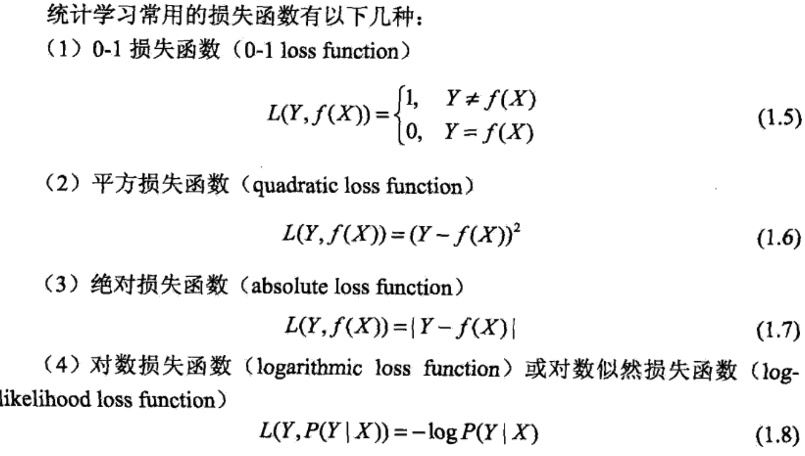
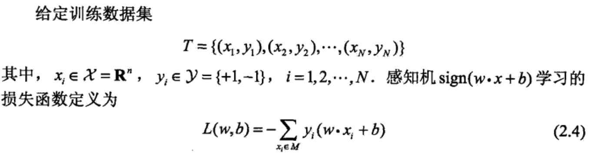
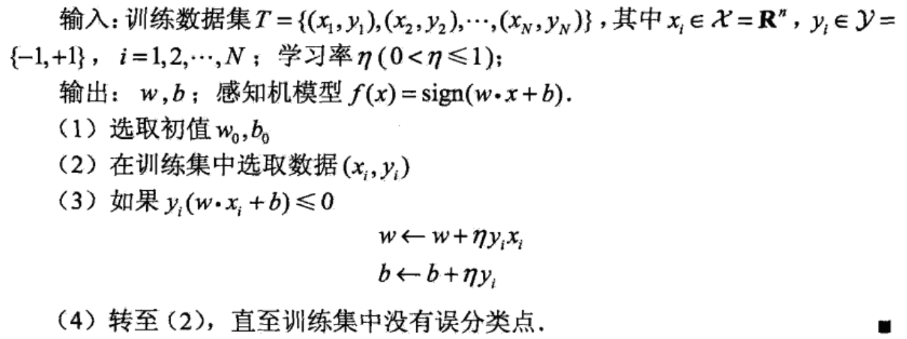
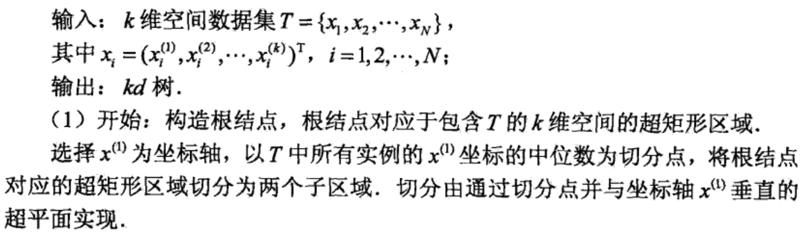
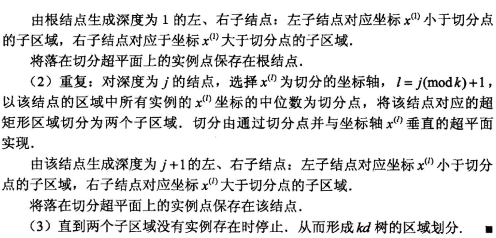
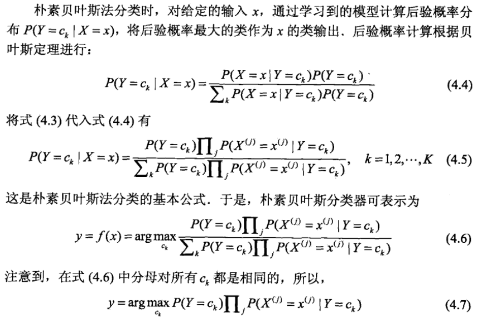
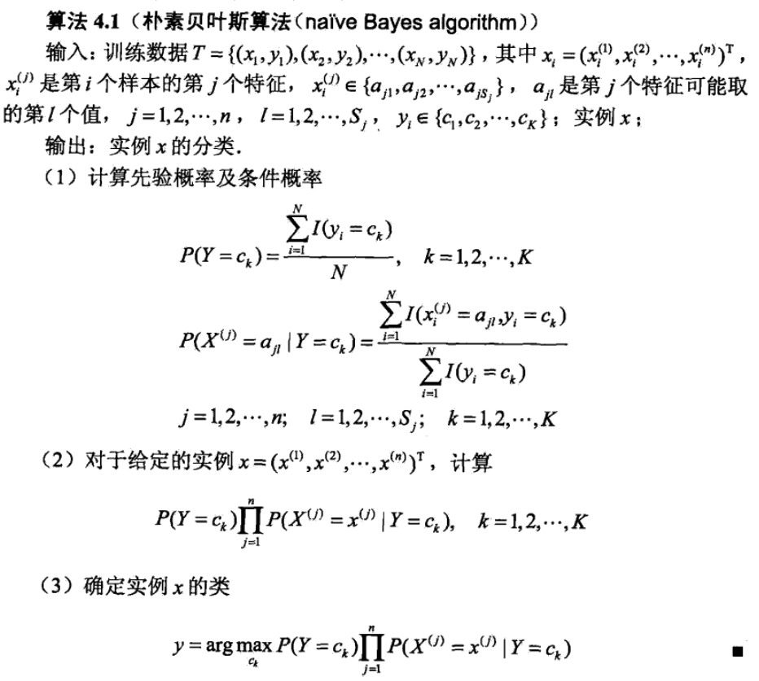
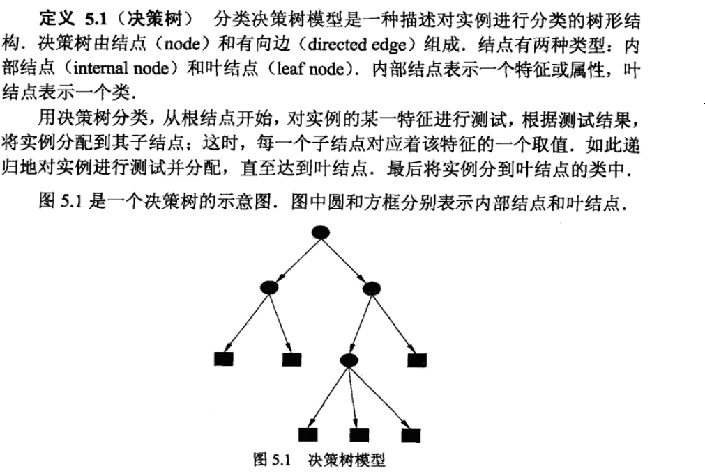

## 统计学习方法整理笔记（1-4）

### 1  统计学习概述

​	统计学习三要素：模型、策略、算法。

#### 1.1 模型

​	模型就是所要学习的条件概率分布或者决策函数

#### 1.2 策略

​	策略即是决定用什么样的准则学习或选择最优的模型。 

1. 损失函数（loss function）

   

2. 经验风险最小化和结构风险最小化

   1. empirical risk minimization，ERM：其理论依据是大数定理。但是通常情况下训练数据较少并不满足大数定理的要求，容易发生过拟合现象。
   2. structural risk minimization，SRM：为了防止过拟合现象，SRM增加正则化项，对模型的复杂度进行约束，要求模型复杂度较小。

#### 1.3 算法

​	算法是指学习模型的具体算法，例如BP算法、EM算法等。

#### 1.4 模型评估与模型选择

​	训练误差、测试误差、交叉验证。

​	生成模型、判别模型。

### 2  感知机模型

#### 2.1 模型 

$$
f(x) = sign(wx + b) \tag{1.1}
$$

$$
sign(x) = \begin{cases} 
		1,  & \text{if x >= 0} \\
		-1, & \text{if x < 0} 
		\end{cases} \tag{1.2}
$$

​	其中所要训练的参数为w和b，感知机模型是一种简单的线性分类模型，属于判别模型。

#### 2.2 策略

定义 loss function：

#### 2.3 算法

SGD算法：

3  KNN模型

#### 3.1 模型

#### 3.2 策略

KNN模型是一个只需正向统计的过程，没有待训练参数，也不需要定义 loss function 。但是在统计前要决定策略三要素：距离度量方法、k值选择和分类决策方法。

1. 距离度量方法： 欧式距离、$L_p$距离、曼哈顿距离等。
2. k值选择：k值越小对临近数据点越敏感，模型越复杂，越容易发生过拟合；k值越大，模型越简单，不易发生过拟合，但是模型能力若，预测能力差。
3. 分类决策方法：多数表决，平均值方法等。

#### 3.3 算法

最简单的算法就是线性搜索所有数据集，找出K个最近邻。其搜索复杂度为O(n)

优化的算法如**kd树算法**，搜索复杂度为 O(log n)

1. 构造kd树

   

   

2. 利用kd树搜索最近邻

   

   

### 4 朴素贝叶斯方法

#### 4.1 模型

朴素贝叶斯法通过训练数据来学习联合概率分布P(X,Y)。根据$P(X,Y) = P(X|Y)P(Y)$，所以如下图所示，我们可以通过学习Y的先验概率分布和X的条件概率分布来确定X与Y的联合分布。

之后根据前面所说的大数定理，训练数据满足这种分布，之后的新数据也当满足这种分布。至于训练数据不足的问题，也可套用结构风险最小的理论。

但是求解P(X|Y)的发杂度非常高，设X为n维向量，$x_j$有$S_j$个不同的取值，Y有K个不同的取值。那么统计P(X|Y)的复杂度为$K\Pi_{j=1}^{n}Sj$.

为降低复杂度，朴素贝叶斯法做了X的每个维度相互独立的假设，那么条件概率分布变为：
$$
P(X=x|Y=y) = P(X^1=x^1,...,X^n = x^n | Y=c_k)  \\
= \Pi_{j=1}^nP(X^j = x^j|Y=c_k) \\
k = 1,2,...,K \tag{4.3}
$$
这样使得模型变得简单，可计算。但是其效果就要差一点。

#### 4.2 策略

朴素贝叶斯的策略被称为后验概率最大化策略，后面会说明这一策略和经验风险最小化策略是等价的。

1. 后验概率最大化策略

   

   ​

2. 后验概率最大等价于经验风险最小

   为了证明这个问题，首先定义0-1损失函数如下：
   $$
   L(Y,F(X)) = \begin{cases}
   1, & Y \neq f(X) \\
   -1, & Y = f(X)
   \end{cases}
   $$
   式中f(X)式分类决策函数. 这时，期望风险函数为
   $$
   R_{exp} = E[L(Y,f(X))]
   $$
   然后利用条件期望全期望公式得：
   $$
   R_{exp}(f) = E_x\sum_{k=1}^K[L(c_k, f(X))]P(c_k|X)
   $$
   因为P(X=x)是确定的，所以只需对X=x的情况下逐个取最小化，如下：
   $$
   \begin{align}
   f(x) & = arg {min}_{y \in Y}\sum_{k=1}^KL(c_k,y)P(c_kX=x) \\
    & = arg {min}_{y \in Y} \sum_{k=1}^KP(y \neq c_k|X=x) \\
    & = arg{min}(1-P(y=c_k|X=x)) \\
    & = arg {max}_{y \in Y}P(y=c_k|X=x)
   \end{align}
   $$
   这样经验风险最小化就和前面的后验概率最大化策略目标相同了

#### 4.3 算法

### 5 决策树模型

#### 5.1 模型

#### 5.2 策略

决策树的学习策略是损失函数最小的策略，但是这一策略在学习算法中不会明显的体现出来。具体的学习算法只会要求对于训练数据，分类尽可能正确。这也就蕴含了损失函数最小的思想。

即是损失函数已经最小了，决策树学习还要求树的结构最优，即树的层数要尽量少。

#### 5.3 算法

从所有的二叉树中找出结构最优的的树是NP难度的问题。所以具体的算法都是启发式的算法，从根节点开始先找到分类最优的分类特征，然后一次递归地执行下去。

常用的算法有ID3，C4.5 与 CART。这些算法基本都基于信息熵和信息增益的理论。

1. 信息熵

   ​

