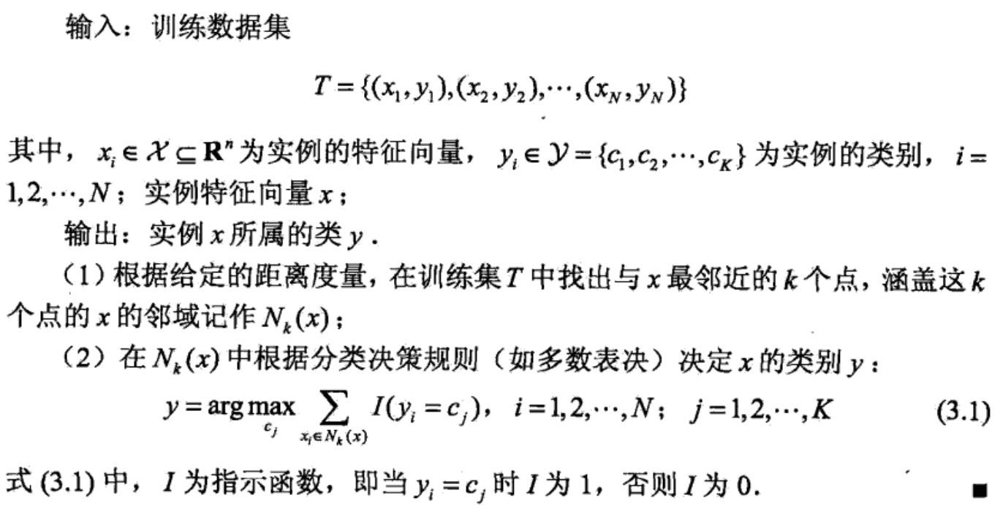

## 统计学习方法--李航

### 1  统计学习概述

​	统计学习三要素：模型、策略、算法。

#### 1.1 模型

​	模型就是所要学习的条件概率分布或者决策函数

#### 1.2 策略

​	策略即是决定用什么样的准则学习或选择最优的模型。 

1. 损失函数（loss function）

   

2. 经验风险最小化和结构风险最小化

   1. empirical risk minimization，ERM：其理论依据是大数定理。但是通常情况下训练数据较少并不满足大数定理的要求，容易发生过拟合现象。
   2. structural risk minimization，SRM：为了防止过拟合现象，SRM增加正则化项，对模型的复杂度进行约束，要求模型复杂度较小。

#### 1.3 算法

​	算法是指学习模型的具体算法，例如BP算法、EM算法等。

#### 1.4 模型评估与模型选择

​	训练误差、测试误差、交叉验证。

​	生成模型、判别模型。

### 2  感知机模型

#### 2.1 模型 

$$
f(x) = sign(wx + b) \tag{1.1}
$$

$$
sign(x) = \begin{cases} 
		1,  & \text{if x >= 0} \\
		-1, & \text{if x < 0} 
		\end{cases} \tag{1.2}
$$

​	其中所要训练的参数为w和b，感知机模型是一种简单的线性分类模型，属于判别模型。

#### 2.2 策略

定义 loss function：

#### 2.3 算法

SGD算法：

3  KNN模型

#### 3.1 模型

#### 3.2 策略

KNN模型是一个只需正向统计的过程，没有待训练参数，也不需要定义 loss function 。但是在统计前要决定策略三要素：距离度量方法、k值选择和分类决策方法。

1. 距离度量方法： 欧式距离、$L_p$距离、曼哈顿距离等。
2. k值选择：k值越小对临近数据点越敏感，模型越复杂，越容易发生过拟合；k值越大，模型越简单，不易发生过拟合，但是模型能力若，预测能力差。
3. 分类决策方法：多数表决，平均值方法等。

#### 3.3 算法

最简单的算法就是线性搜索所有数据集，找出K个最近邻。其搜索复杂度为O(n)

优化的算法如**kd树算法**，搜索复杂度为 O(log n)

1. 构造kd树

   

   

2. 利用kd树搜索最近邻

   

   

### 4 朴素贝叶斯方法

