# ICML2018 GAN 理论文章总结

武多才，2018/7/14

## 1 介绍

这个部分有五篇文章，其中：

1. 两篇文是通过改变GAN的结构以解决GAN训练困难和模式消失（Mode collapse）的问题。
2. 一篇文章从新的数学角度推导GAN的更新过程，该更新过程更一般化，原有的GAN参数更新过程可视为其某种条件下的特例。文中也简要说明了该更新过程是 stable 的。
3. 一篇文章探究了GAN中生成器的 Jacobian 矩阵的奇异值分布和 GAN 性能的关系。这篇文章很有趣，它根据生成器的 Jacobian 矩阵定义了一个**condition number**，然后在训练过程中发现该值与常用的GAN评估方法 **Inception Score** 和 **Frechet Inception Distance** 的评估值十分相关，最后文中提出一种方法通过控制 **condition number** 来改进 GAN 的训练过程。
4. 一篇文章提出一种新的方法计算WGAN中 Wasserstein distance，同时做了许多相关的理论推导。 这篇文章理论知识很多，我看起来很费劲，也很困惑。文章中虽然做了很多的工作，但是相比于WGAN没有太大的创新。

## 2 Tempered Adversarial Networks 

​	这篇文章认为 GAN 之所以训练困难的一种可能原因在于判别器在训练过程中可以利用生成的数据和真实的数据，但是由于真实数据固定不变，生成器却只可以利用生成的数据。这也就是说，训练过程中，生成器和判别器对数据的使用不平衡。针对这一点文中提出了一种方法使得生成器也可以利用真实的数据。

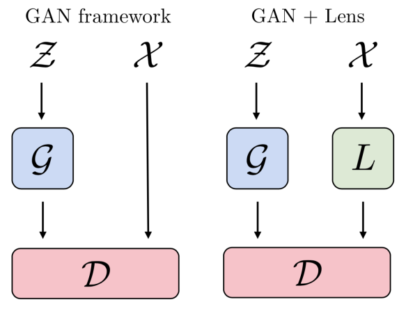

​	如上图所示，左边部分是原本的 GAN 模型，GAN 的训练目标如下：
$$
min_Gmax_Dv(D,G) = E_{x \sim X}[log(D(x))] + E_{z \sim Z}[1 - log(D(G(z))]
$$
​	右边是文中提出的模型，该模型在真实数据 $X$ 和 判别器 $D$ 之间增加了一个 $L$ 模块，该模块接受真实数据做为输入然后输出维度相同的数据。该模块有两个损失函数。其一是对抗判别器的损失函数, 也就大约等于判别器损失函数的负数，如下：
$$
L_L^A ≈ -L_D
$$
​	另一个是重构损失函数以保证判别器的输入符合真实数据分布，如下：
$$
L_L^R = ||X - L(X)||_2^2
$$
​        $L$ 模块的最终损失函数如下：
$$
L_L = \lambda L_L^A + L_L^R
$$
​	文中指出，$L$ 模块在训练过程中既要充分重构真实的数据（$L_L^R$），使得判别器能够得到有效训练；又要将真实数据映射到与生成数据分布接近的数据分布（$L_L^A$），以此来解决原本GAN中判别器和生成器对数据利用不平衡的问题。

​	但这实际上是一个两难的问题，作者的训练经验指出在训练过程中 $\lambda$ 在训练过程中从 1 开始然后逐渐减小，直至 K 次训练之后变为0，如下：
$$
\lambda = \begin{cases}
1- sin(t\pi/2K), t \le K \\
0, t > K
\end{cases}
$$
​	作者认为GAN训练困在在于判别器和生成器对于数据利用不平衡，所以修改GAN结构，增加$L$模块来对抗判别器以弥补这种不平衡。这种方法在理论上没有很强的可解释性，作者通过实验证明该模型FID（Frechet Inception Distance）评估值优于基本的GAN。

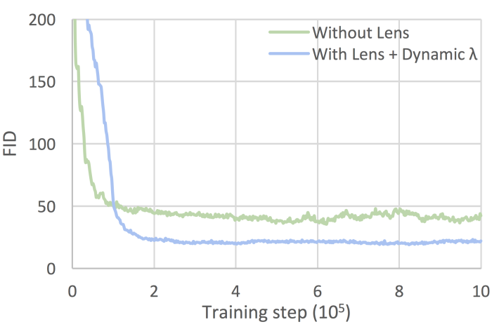

## 3 Improved Training of Generative Adversarial Networks using Representative Features

​	这篇文章主要考虑 GAN 训练困难，生成图片质量差，生成图片多样性不足（Mode collapse）。其思路是先使用 Auto Encoder 模型提出图片的表示特征，然后用这些特征限制判别器的训练过程以提高训练的稳定性，从而解决生成图片质量差，多样性不足的问题。

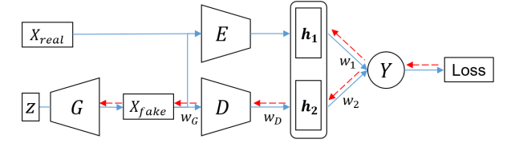

​	该模型如上图所示，$E$ 模块表示训练好的AE模型的Encoder模块，$Y$模块是 sigmoid 激活函数。该模型将判别器输出的判别器特征 $h_2$ 和 预训练好的 Encoder 模块输出的表示特征 $h_1$ 拼接为一个长向量作为二分类器 $Y$ 的输入判别真假。图中蓝色实线表示前向过程，红色虚线表示后向参数更新过程。

​	文中指出，AE的训练目标可以解释为优化前向的 KL 散度，$KL(P_{data}||P_{model})$,  其积分项是对 $P_{data}$ 的概率分布做积分，这样计算 KL 散度就会用到每一个真实的数据样本。这样训练出的特征趋向于真实数据分布的均值，可以有效地表示整体的数据模式。

​	相反的GAN的训练目标可以解释为后向的KL散度，$KL(P_{model}||P_{data}) - 2JSD$, 其中JSD是 Jensen-Shannon 散度。其积分项是对生成数据分布 $P_{model}$ 做积分，训练过程中并没有依据整体的真实数据分布做出惩罚。所以GAN倾向于学习到真实数据分布中一个局部的，partial 的模式。这也是为什么 GAN 训练容易导致 Model collapse。所以将AE输出的表示特征结合进GAN的训练过程中可以抑制走向 Model collapse 的趋势。

​	此外，文中也提到了之前的工作指出，AE训练出的特征趋向于真实数据分布的均值，这样的特征只容易区分质量差的假样本(还有生成图片质量差，模糊)。所以文中指出AE的特征在训练开始时很有用，在训练后期实际上是干扰了训练过程，但是此时GAN的生成器特征依然发挥作用，促进训练。

​	总结来说，AE的特征和判别器特征在训练的过程中是对抗的作用，AE的特征趋向于真实数据分布的均值，可以抑制局部的，partial 的Mode collapse。

​	这篇文章的做法比上一篇的文章的做法的理论解释性强一点，此外作者用Inception score评估了模型的性能要优于基本 GAN.

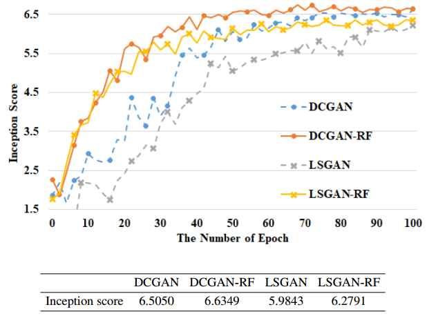

## 4 Composite Functional Gradient Learning of Generative Adversarial Models

​	文章提出一种新的理论来推导GAN模型的更新过程，并且指出如果有一个 strong discriminator，可以使得在学习生成器的每一次迭代中，真实数据分布和生成数据分布之间的 KL 散度都会收敛。文中也简要说明了这种更新方法是 stable 的。

​	该理论的目标是学习一个好的的生成器 $G(z)$ 使得生成数据的分布越来越接近真实数据的分布。使用 functional gradient learning 的方法，$G(z)$的更新公式如下：
$$
G_t(Z) = G_{t-1}(Z) + \eta_tg_t(G_{t-1}(Z)) \tag{1}
$$
其中，$\eta_t$ 是学习率，接下来的目标就是要根据真实数据分布推导出函数 $g_t$。

​	我们将真实的数据分布记为 $p_\star$ , 生成的数据分布记为 $p$, 记 $X$ 为符合分布 $p$ 的随机变量。使用 KL 散度来衡量真实数据分布和生成数据分布之间的距离，如下：
$$
L(p) = \int p_\star (x)ln\frac{p_\star (x)}{p(x)}dx \tag2
$$
​	我们的目标就是找到函数 g, 使得随机变量 $X^{'} = X + \eta g(X)$ （等同于公式（1））的分布更加接近真实数据分布$p_\star$ ，也就是$L_(p)$不断减小。

​	为了找到合适的函数 g，作者首先定义了前文提到的 strong discriminator D，就是逻辑回归的损失函数，也就是原本GAN的判别器最后使用 sigmoid 激活函数的最优解，如下：
$$
D \simeq argmin_{D^{'}}[1/|S_\star|\sum_{x \in S_\star}ln(1 + e^{-D^{'}(x)}) + 1/|S|\sum_{x \in S}ln(1 + e^{D^{'}(x)}) ] \tag3
$$
其中，S是生成的数据，$S_\star$ 是真实地数据。然后，作者推导出函数 g 的一个合理的取值为：
$$
g(x) = s(x)\nabla D(x) \tag4
$$
其中，s(x) 为任意取值大于0地函数，例如 s(x) = 1. 使用该函数 g 可以使得每一次迭代之后，L(p) 减小。

​	该理论的基本更新算法如下, 在每一次迭代中，先解出 strong discriminator D(x), 然后根据 D(x) 计算函数 g，最后利用公式（1）更新生成器

​	该算法每次迭代都使用所有的样本计算判别器地最优值，这样容易导致过拟合，所以作者又提出一个 Incremental CFG，实际上就是mini-batch版, 在求解 D 时，只随机采样一部分样本，如下：

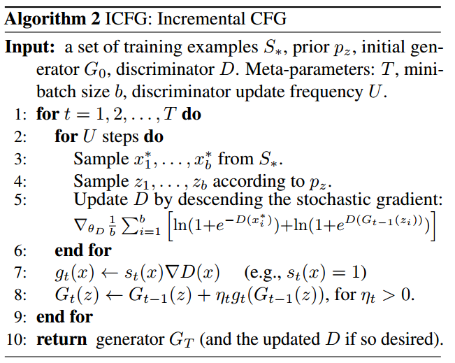

​	为了涵盖普通 GAN，作者又进一步修改，提出了 xICFG,  GAN 就是 xICFG 某种参数设置下地特例。如下：

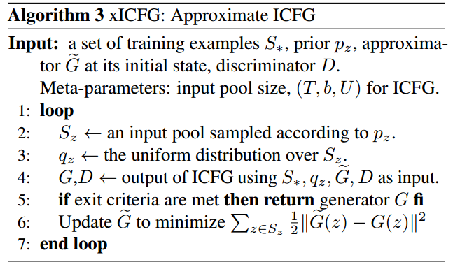

​	相比于ICFG，该做了如下修改：1. 用一个生成器 $\hat{G}$ 作为初始生成器，然后使用 ICFG 算法迭代T次返回的判别器就直接覆盖D参与下一次迭代，不同的是返回的生成器记为新的临时判别器G。2. 更新判别器 $\hat{G}$ 使之逼近临时判别器G。

下面说明 GAN 是 xICFG 的一个特例。

GAN的算法如下：

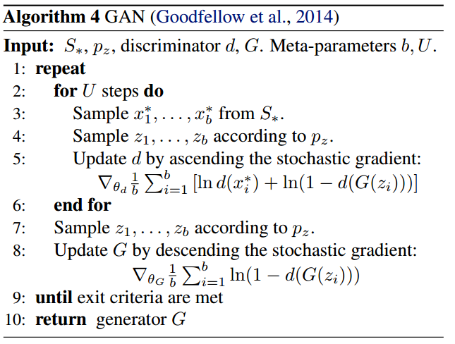

​	GAN形式上的不同点，首先再判别器部分。但是根据前面所说，只要 GAN 中 d(x) 最终的激活函数是 sigmoid 函数，这部分就相同了。如下：
$$
d(x) = \frac{1}{1 + exp(-D(x))}
$$
​	其次是生成器部分，GAN中梯度的第推导如下：

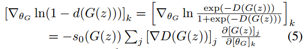

​	其中，$s_0(x) = 1/ (1 + exp(-D(x)))$。

​	接下来推导xICFG中的梯度，令 ICFG算法中的T = 1，文中推导了 xICFG中 的梯度与公式（5）相同。

​	最后该文简要说明GAN为什么 unstable, 以突出该算法是 stable。GAN不 stable 是因为 GAN 的参数更新过程相对于 xICFG 过多简化，有两点 “an extremely small T（T = 1）and coarse approximation ”。虽然GAN的不 stable问题是一大热点，但是该文提出的原因不是很突出。首先这两点理由不是很好理解，也没有像WGAN那样好的理论推导，也没有设计实验验证stable这一点，就提了以下。

​	该文的实验评估标准与前文一样，为 Inception Score。都取得了不错的效果。实验结果如下：

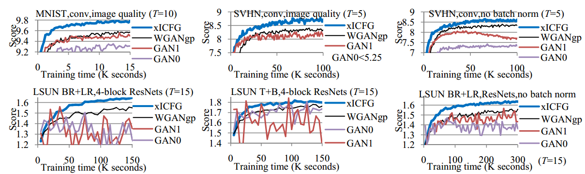

## 5 Is Generator Conditioning Causally Related to GAN Performance?

​	之前有一篇文章[Penninton, 2017](https://arxiv.org/abs/1711.04735)指出在深度学习网络中控制 Jacobian 阵的奇异值分布可以有效影响网络性能。所以文中作者就研究了GAN中生成器的 Jacobian 阵的奇异值分布的影响。

​	生成器 $G$ 将维度为 $n_z$ 的隐空间数据映射到维度为为 $n_x$ 的真实数据空间数据。记:
$$
Z := R^{n_z}, X := R^{n_x} \\
G: z \in Z \to x \in X
$$
则 G 有一个关于 $z \in Z$ 的 Jacobian 阵 $J_z$:
$$
J_z \in R^{n_x \times n_z} , \\
(J_z)_{i,j} := \frac{\partial G(z)_i}{\partial z_j} \\
记映射 M:z\in Z \to J_z^TJ_z , M_z = J_z^TJ_z\\
记 \lambda_1, ..., \lambda_{n_z} 和 v_1, ..., v_{n_z} 为 M_z 的特征值和特征向量，其有如下性质：\\
lim_{\epsilon \to 0}\frac{||G(z) - G(z + \epsilon v_k)||}{||\epsilon v_k||} = \sqrt{\lambda_k} \tag{5.1}
$$
$M_z$的特征值就是$J_z$的平方奇异值，然后作者定义了一个 condition number: $\frac{\lambda_{max}}{\lambda_{min}}$ 。然后作者做了很多实验探究该值与GAN的常用的评估值 Inception Score 和 Frechet Inception Distance 之间的关系。下图是一个样例。

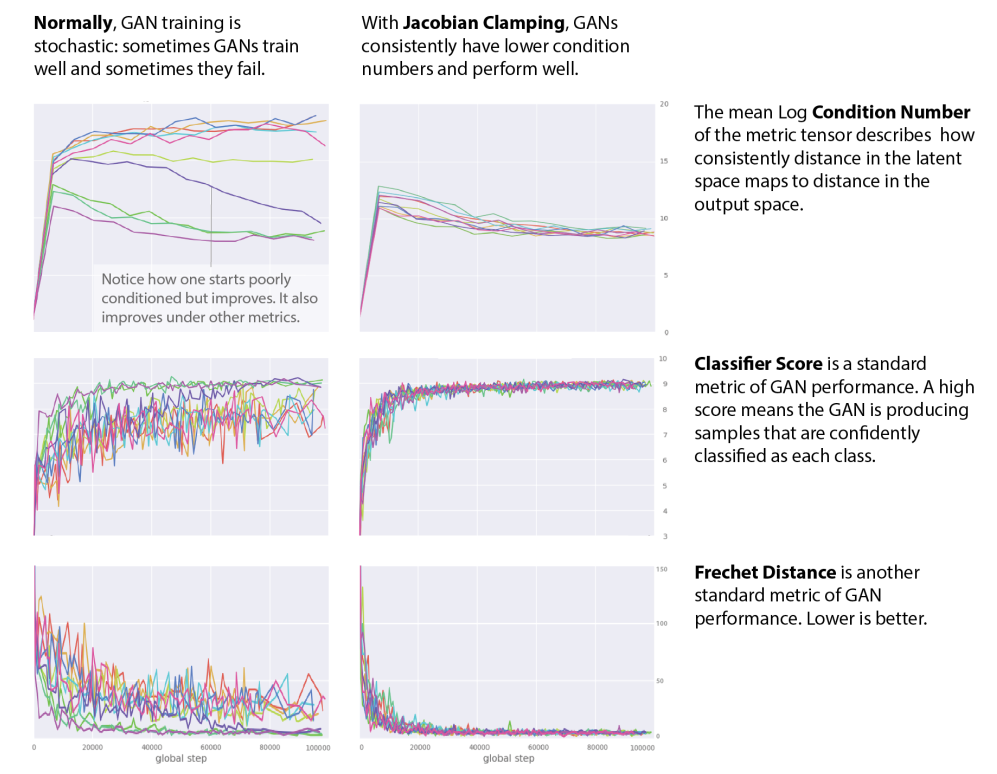

先看左边三幅图，图中每条线是同一个 GAN 结构每次训练的记录，从上至下三幅图分别记录 Condition Number, Inception Score, Frechet Inception Distance。图中包含以下信息：

1. GAN训练很不稳定，从图中可以看出每次训练的结果都差异巨大。
2. 通过Condition Number的值可以很好的预测IS和FID评估值的状况，首先是Condition Number的值在每次训练过程中很不稳定，对应的评估值在每次训练中的记录也很不稳定。此外图中标识出的紫色线很好的可以说明Condition Number 与 IS 和 FID值同变换。当Condition Number变小的时候，IS值显著上升，FID值显著下降。其中IS值是越大越好，FID值是越小越好。

通过以上实验说明控制Condition Number使之减小波动并且变小有可能可以很好的提升GAN的训练稳定性和性能。所以作者提出了Jacobian Clamping 的方法，首先看效果，上图右边三幅图是加了 Jacobian Clamping 之后的结果。可以看出每次训练的情况大体相同，提高了训练的稳定性，并且性能都很接近未加 Jacobian Clamping情况下最好的结果。

​	文中指出直接惩罚condition number的值复杂度很高，因为计算最小特征值比较复杂。所以作者提出 Jacobian Clamping 的方法将所有特征值都大约限制在 $[\lambda_{min}, \lambda_{max}]$ 范围内，如下图所示，可以这么做是因为特征值有前面公式(5.1)的性质。

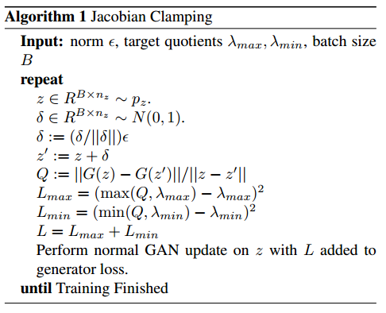

## 6 A Two-Step Computation of the Exact GAN Wasserstein Distance

### 6.1 WGAN

GAN的训练目标如下：
$$
% <![CDATA[
\begin{aligned}
\min_G \max_D L(D, G) 
& = \mathbb{E}_{x \sim p_{r}(x)} [\log D(x)] + \mathbb{E}_{z \sim p_z(z)} [\log(1 - D(G(z)))] \\
& = \mathbb{E}_{x \sim p_{r}(x)} [\log D(x)] + \mathbb{E}_{x \sim p_g(x)} [\log(1 - D(x)]
\end{aligned} %]]>
$$
其中判别器 $D$ 的最优解为：
$$
D^*(x) = \tilde{x}^* = \frac{A}{A + B} = \frac{p_{r}(x)}{p_{r}(x) + p_g(x)} \in [0, 1]
$$
然后 WGAN 的文章中指出 GAN的目标实际上是优化 Jenson-Shannon 散度。JS 散度定义如下：
$$
D_{JS}(p \| q) = \frac{1}{2} D_{KL}(p \| \frac{p + q}{2}) + \frac{1}{2} D_{KL}(q \| \frac{p + q}{2})
$$
 其中, $D_{KL}$为 KL 散度，定义如下：
$$
D_{KL}(p \| q) = \int_x p(x) \log \frac{p(x)}{q(x)} dx
$$
对JS散度作如下推导：
$$
% <![CDATA[
\begin{aligned}
D_{JS}(p_{r} \| p_g) 
=& \frac{1}{2} D_{KL}(p_{r} || \frac{p_{r} + p_g}{2}) + \frac{1}{2} D_{KL}(p_{g} || \frac{p_{r} + p_g}{2}) \\
=& \frac{1}{2} \bigg( \log2 + \int_x p_{r}(x) \log \frac{p_{r}(x)}{p_{r} + p_g(x)} dx \bigg) + \\& \frac{1}{2} \bigg( \log2 + \int_x p_g(x) \log \frac{p_g(x)}{p_{r} + p_g(x)} dx \bigg) \\
=& \frac{1}{2} \bigg( \log4 + L(G, D^*) \bigg)
\end{aligned} %]]>
$$
然后得出如下结论，可以看出 GAN 的训练目标实际上是优化 JS 散度（当判别器最优的时候）。
$$
L(G, D^*) = 2D_{JS}(p_{r} \| p_g) - 2\log2
$$
文中指出使用 JS 散度并不好，使用 Wasserstein Distance 会好一点，Wasserstein Distance 定义如下：
$$
W(p_r, p_g) = \inf_{\gamma \sim \Pi(p_r, p_g)} \mathbb{E}_{(x, y) \sim \gamma}[\| x-y \|]
$$
文中举了一个简单例子来说明 Wasserstein Distance 的优势，假设两个概率分布 P 和 Q：
$$
\forall (x, y) \in P, x = 0 \text{ and } y \sim U(0, 1)\\
\forall (x, y) \in Q, x = \theta, 0 \leq \theta \leq 1 \text{ and } y \sim U(0, 1)\\
$$
P 和 Q 的概率图如下：

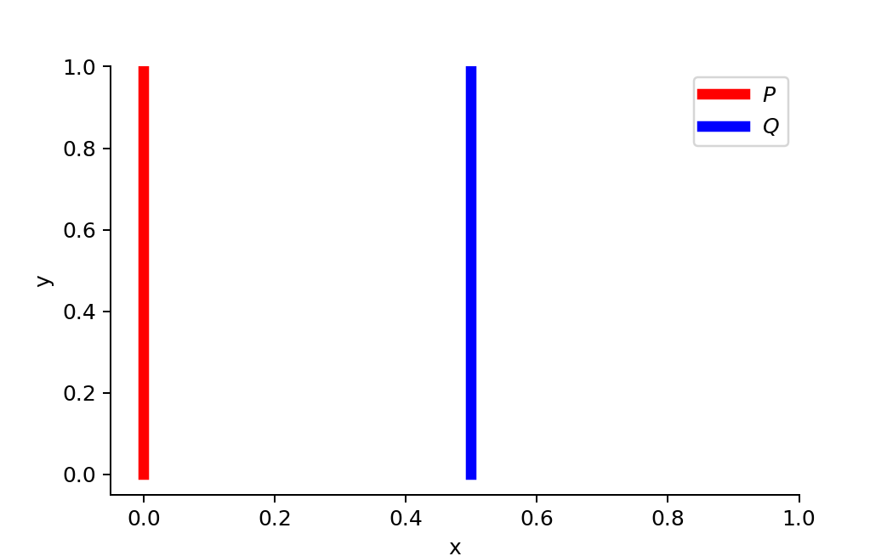

当 $ \theta \neq 0$  时：
$$
% <![CDATA[
\begin{aligned}
D_{KL}(P \| Q) &= \sum_{x=0, y \sim U(0, 1)} 1 \cdot \log\frac{1}{0} = +\infty \\
D_{KL}(Q \| P) &= \sum_{x=\theta, y \sim U(0, 1)} 1 \cdot \log\frac{1}{0} = +\infty \\
D_{JS}(P, Q) &= \frac{1}{2}(\sum_{x=0, y \sim U(0, 1)} 1 \cdot \log\frac{1}{1/2} + \sum_{x=0, y \sim U(0, 1)} 1 \cdot \log\frac{1}{1/2}) = \log 2\\
W(P, Q) &= |\theta|
\end{aligned} %]]>
$$
当 $\theta = 0$ 时，此时两个分布完全重合：
$$
% <![CDATA[
\begin{aligned}
D_{KL}(P \| Q) &= D_{KL}(Q \| P) = D_{JS}(P, Q) = 0\\
W(P, Q) &= 0 = \lvert \theta \rvert
\end{aligned} %]]>
$$
可以看出，JS 散度的值当 $\theta = 0$ 时突然降到0，相反的 Wasserstein 就一直有一个平滑的过度，这一点非常有助于训练的稳定性。

计算Wasserstein Distance 需要所有可能的联合分布，这基本不可能。所以作者依据 Kantorovich-Rubinstein duality 做了一个巧妙地变换，如下：
$$
W(p_r, p_g) = \frac{1}{K} \sup_{\| f \|_L \leq K} \mathbb{E}_{x \sim p_r}[f(x)] - \mathbb{E}_{x \sim p_g}[f(x)]
$$
其中，$\|f\| \le K$ 表示函数 f 是 K-Lipschitz continuous,  其定义如下：

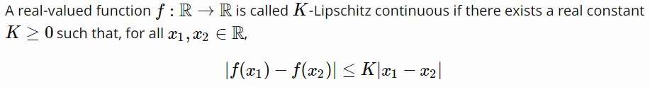

WGAN 中 K 地取值为 1。同时 WGAN 使用限制 f 的参数在（-c, c）之间来实现近似满足 K-Lipschitz continuous 的条件。算法如下：

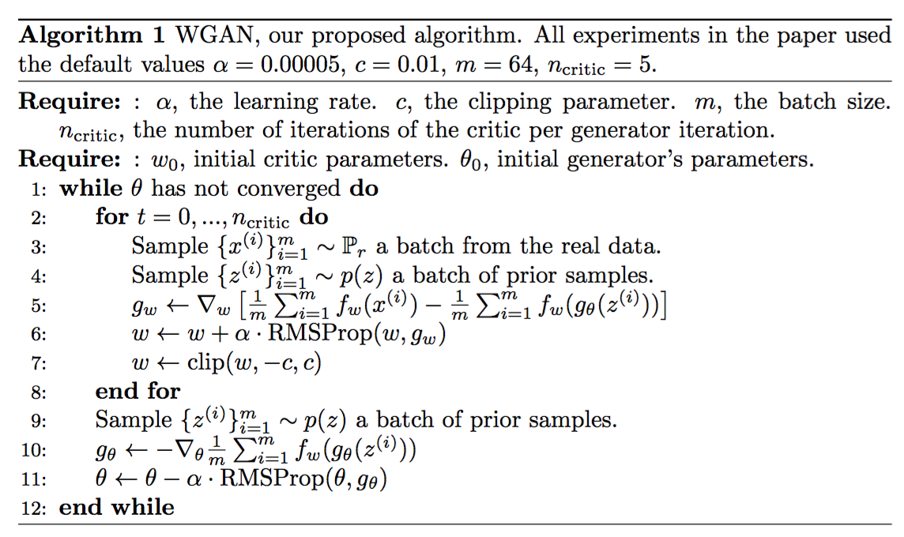

WGAN可以解释为，判别器的直接目标是扩大 Wasserdistein 距离，可以理解为尽力对抗生成器，找到一个好的函数 f ，使之能够更苛刻地衡量Wasserstein Distance，生成器的目标是缩小这个距离，使得生成数据更符合真实数据分布。

### 6.2 Two-Step Computation

这篇文章挑了 WGAN 两点毛病：

1. WGAN 使用非常简化的1-Lipschitz continuous（WGAN中K值取1）函数 f 来满足Kantorovich-Rubinstein duality 的条件，本文中提出了更宽松函数 f。
2. WGAN 中 clip 函数 f 的参数方法有超参数 c，文中提出了不需要超参的 weight scaling 方法。

此外，本文做了了如下事情：

1. 训练的时候提出了两步的策略：第一步先计算策略 T 使之最大化 Wasserstein distance，然后训练函数 f 使之逼近这个策略 T。WGAN中直接训练 f 最大化 Wasserstein distance (前图算法5-7步)
2. 计算了 Wasserstein distance 的大概边界。
3. 实验验证模型效果。

Kantorovich-Rubinstein duality 指出的一般化的计算 Wasserstein distance 的公式如下：

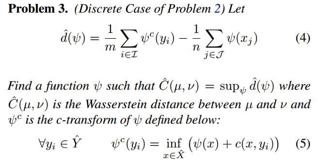

WGAN中，$\psi$ 函数取为 1-Lipschitz continuous 的函数，是满足条件(5)的。

本文提出了相比于 1-Lipschitz continuous 更宽松的限制，但也和 Problem 3 等价，如下：

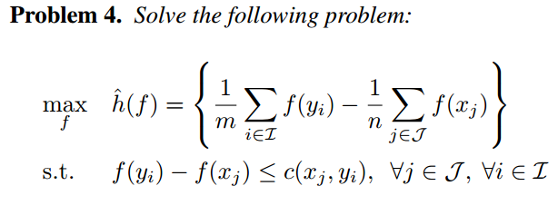

文中证明了函数 c 只要满足三角不等式。虽然提出了这样宽泛的理论形式，但是实现却没有使用，根据后面的具体算法实现，使用了$c(x_j, y_i) = \|y_i - x_j\|_1$, 这个就和 WGAN 是一样的。

然后就是训练中的两步走方法。第一步计算策略 T 最大化 Wasserstein distance如下：

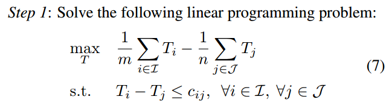

第二步训练函数f，使之逼近策略 T，如下：

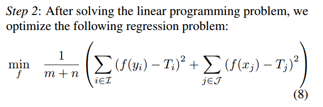

文中没有很好的说明这样做的优势。

将GAN中生成器和判别器带入 Problem 4 就得到如下训练目标：

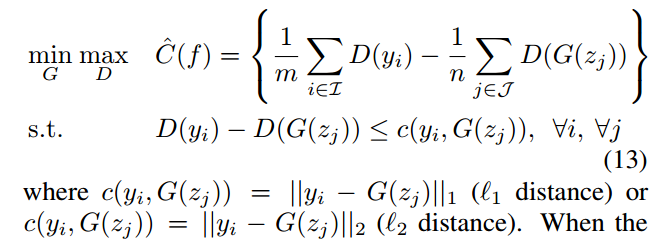

然后相对于WGAN中处理函数 f 的参数的 clip 方法，本文提出了新的 Weight Scaling方法。文中说，实践中

发现满足公式（13）中的限制条件比单独优化目标更重要。所以文中提出参数限制条件，使得公式（13）的限制条件得到满足，如下，先计算 Scaling 的倍数值 $\beta$：

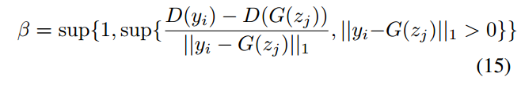

然后缩放判别器的参数： $D_{w/\beta} (.) = D_w(.)/ \beta$

最终模型算法如下：

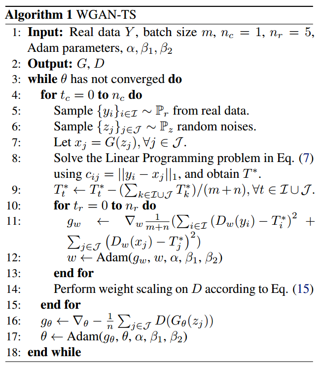

总的来说，前面WGAN指出 GAN 的问题理论上说的非常圆满，这篇文章围绕WGAN做了很多相关的推导，但是结论的优势却没有体现，应该确实是工作量多吧，后面也有很多实验。