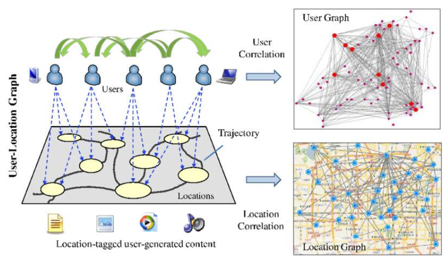

# Memo: Location Based Social Network

Date: 2017/10/23 

Author: Wu

## 1 Concept

LBSN does not only mean adding a location information to traditional Social Network, but also consists of new social structure made up of individuals connected by the interdependency derived from their locations
in the physical world. All the information is simply classified as follows:

1. Social network: friends, groups.
2. Social structure can share location-embedded information
3. New social structure made up of individuals connected by the interdependency derived from their locations in the physical
4. Location-tagged media content, such as photos, video, and text

The following part will introduce some works in LBSN

## 2 Outline of related works

### 2.1 POI

1. A computer movie simulating urban growth in the Detroit region 
2. Exploiting geographical influence for collaborative point-of-interest recommendation
3. Time-aware point-of-interest recommendation
4. Fused Matrix Factorization with Geographical and Social Influence in Location-Based Social Networks 
5. A general geographical probabilistic factor model for point of interest recommendation
6. iGeoRec: A Personalized and Efficient Geographical Location Recommendation Framework
7. CoRe: Exploiting the personalized influence of two-dimensional geographic coordinates for location recommendations 
8. GeoMF: Joint Geographical Modeling and Matrix Factorization for Point-of-Interest Recommendation 

### 2.2 Group Recommendation

1. Flickr group recommendation based on tensor decomposition 
2. Combinational collaborative filtering for personalized community recommendation 
3. Recommending Flickr groups with social topic model 
4. Case-based group recommendation: Compromising for success
5. Combinational Collaborative Filtering for Personalized Community Recommendation 

### 2.3 Friend Recommendation

1. Mining User Similarity from Semantic Trajectories 
2. Exploiting place features in link prediction on location-based social networks

## 3 Detail: A computer movie simulating urban growth in the Detroit region  

Tobler’s First Law:  Everything is related to everything else, but near things are more related than distant thing.

1. users prefer to visit nearby POIs rather than distant ones;
2. users may be interested in POIs surrounded a POI that users prefer. 

