# Oh! Capsule

date: 2017/11/09, author: wu

## 1 Transforming Auto-encoder(ICANN 2011 )

### 1.1 Introduction

> Artificial neural networks should use local “capsules” that perform some quite complicated internal computations on their inputs and then encapsulate the results of these computations into a small vector of highly informative outputs. Each capsule learns to recognize an implicitly defined visual entity over a limited domain of viewing conditions and deformations and it outputs both the probability that the entity is present within its limited domain and a set of “instantiation parameters” that may include the precise pose, lighting and deformation of the visual entity relative to an implicitly defined canonical version of that entity. When the capsule is working properly, the probability of the visual entity being present is locally invariant – it does not change as the entity moves over the manifold of possible appearances within the limited domain covered by the capsule. The instantiation parameters, however, are “equivariant” – as the viewing conditions change and the entity moves over the appearance manifold, the instantiation parameters change by a corresponding amount because they are representing the intrinsic coordinates of the entity on the appearance manifold. 

### 1.2 Details about a image shift example

1. Model graph

   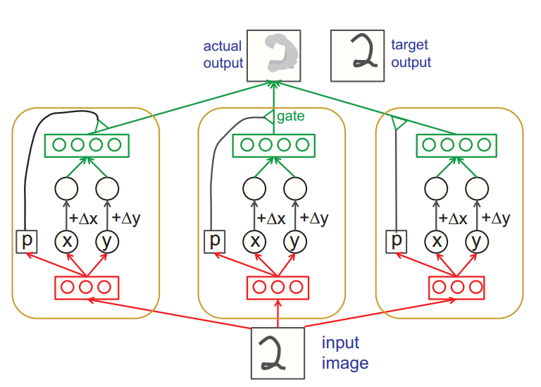

2. Core codes (use tensorflow)

   ```python
     def build(self, X_in, extra_in):
       rec = tf.sigmoid(self.fc_layer(X_in, self.in_dim, self.r_dim,
                                      'recog_layer_pre_act'), 'recog_layer')

       xy_vec = self.fc_layer(rec, self.r_dim, 2, 'xy_prediction')
       pro = tf.sigmoid(self.fc_layer(rec, self.r_dim, 1,
                                      'probability_lin'),'probability_prediction')
       probability_vec = tf.tile(pro, (1, self.in_dim))

       xy_extend = tf.add(xy_vec, extra_in)
       gen = tf.sigmoid(self.fc_layer(xy_extend, 2, self.g_dim, 'gen_pre_act'), 
                        'gen_layer')

       out = self.fc_layer(gen, self.g_dim, self.in_dim, 'out_prediction')

       return tf.multiply(out, probability_vec)
   ```

3. Experiment Result

   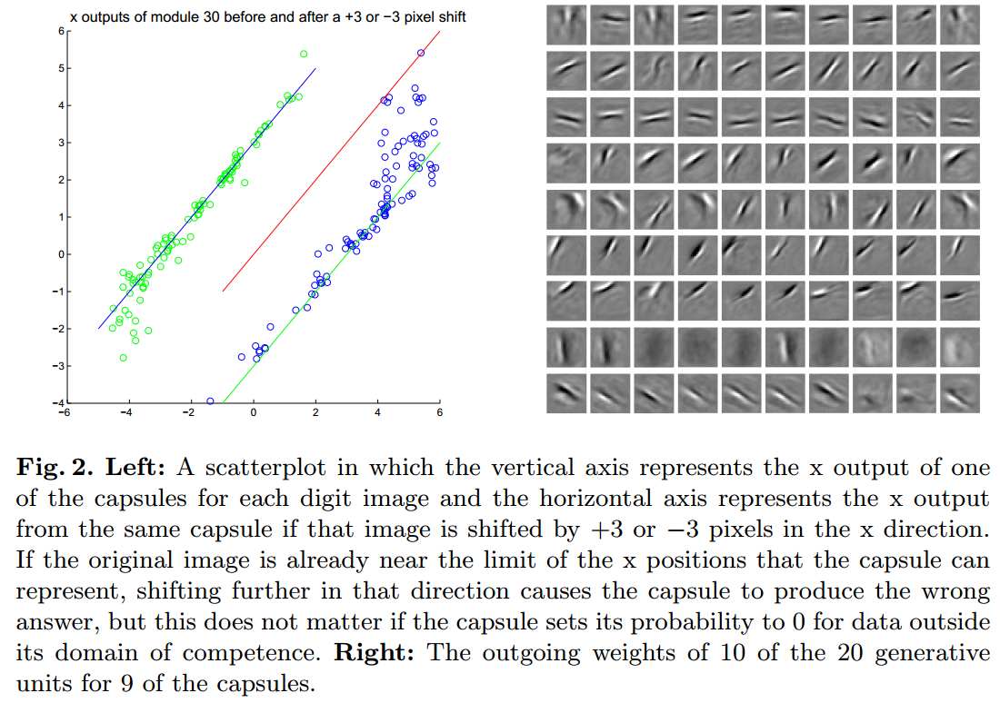

### 1.3 Work to do

​	Once pixel intensities have been converted into the outputs of a set of active, first-level capsules each of which produces an explicit representation of the pose of its visual entity, it is relatively easy to see how larger and more complex visual entities can be recognized by using **agreements of the poses** predicted by active, lower-level capsules. 

​	**Agreements of the poses example**： If a capsule can learn to output the pose of its visual entity in a vector that is linearly related to the “natural” representations of pose used in computer graphics, there is a simple and highly selective test for whether the visual entities represented by two active capsules, A and B, have the right spatial relationship to activate a higher-level capsule, C. Suppose that the pose outputs of capsule A are represented by a matrix, TA, that specifies the coordinate transform between the canonical visual entity of A and the actual instantiation of that entity found by capsule A. If we multiply TA by the part-whole coordinate transform TAC that relates the canonical visual entity of A to the canonical visual entity of C, we get a prediction for TC. Similarly, we can use TB and TBC to get another prediction. If these predictions are a good match, the instantiations found by capsules A and B are in the right spatial relationship to activate capsule C and the average of the predictions tells us how the larger visual entity represented by C is transformed relative to the canonical visual entity of C. If, for example, A represents a mouth and B represents a nose, they can each make a prediction for the pose of the face. If these predictions agree, the mouth and nose must be in the right spatial relationship to form a face. An interesting property of this way of performing shape recognition is that the knowledge of part-whole relationships is viewpoint-invariant and is represented by weight matrices whereas the knowledge of the instantiation parameters of currently observed objects and their parts is viewpoint-equivariant and is represented by neural activities  

##2 Dynamic Routing Between Capsules(NIPS 2017)

### 2.1 Introduction

​	The previous paper said that: "Once pixel intensities have been converted into the outputs of a set of active, first-level capsules each of which produces an explicit representation of the pose of its visual entity, it is relatively easy to see how larger and more complex visual entities can be recognized by using **agreements of the poses** predicted by active, lower-level capsules. " But it didn't do the work to build a multilayer capsules network.

​	This paper give a implementation of the multilayer capsules network that do classification work on **MNIST** dataset. And it give a routing algorithm comparing to just the word **agreements**. It give a detail formulation to measure **agreements**. Then it use **Margin Loss** and **Reconstruction** as a regularization method 

​	Besides, instead of  using common full connection layer to initialize the first-level capsules, it use convolutional neural network to do this work. The paper says: "Convolutional neural networks (CNNs) use translated replicas of learned feature detectors and this allows them to translate knowledge about good weight values acquired at one position in an image to other positions. This has proven extremely helpful in image interpretation. Even though we are replacing the scalar-output feature detectors of CNNs with vector-output capsules and max-pooling with routing-by-agreement, we would still like to replicate learned knowledge across space, so we make all but the last layer of capsules be convolutional. " 

### 2.2 Model detail

1. Model graph

   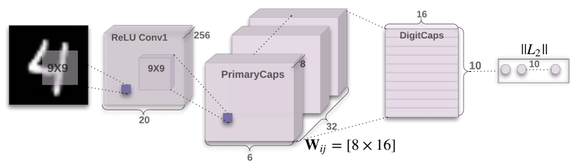

2. Core codes and algorithms

   1. First layer is a common convolutional layer

   2. Second layer is PrimaryCaps layer.  But One can see ist as a Convolution layer with $$v_j = \frac{||s_j||^2}{1 +||s_j||^2 }\frac{s_j}{||s_j||}$$  as its block non-linearity.  Just as the following codes.(In the following codes, squash is a function to implement the former eq. )

      ```python
      def PrimaryCap(inputs, dim_vector, n_channels, kernel_size, strides, padding):
          outputs = []
          output = layers.Conv2D(filters=dim_vector*n_channels, kernel_size=kernel_size,
                                 strides=strides, padding=padding)(inputs)
          outputs = layers.Reshape(target_shape=[-1, dim_vector])(output)
          return layers.Lambda(squash)(outputs)
      ```

   3. In total PrimaryCapsules has [32; 6; 6] capsule outputs (each output is an 8D vector) . (shape is [32\*6\*6, 8]). The third layer is Digit layer. Between these two layers, the author use the routing algorithm as bellow.

      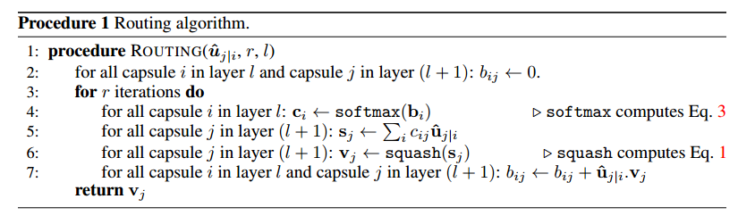

   4. Margin loss.

      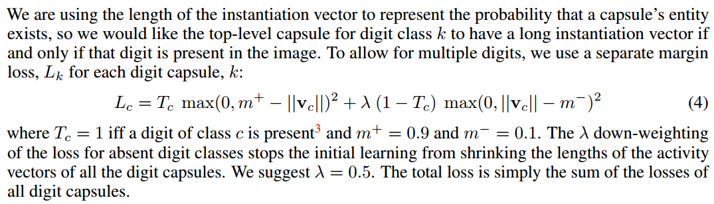

   5. Reconstruction as a regularization method.

      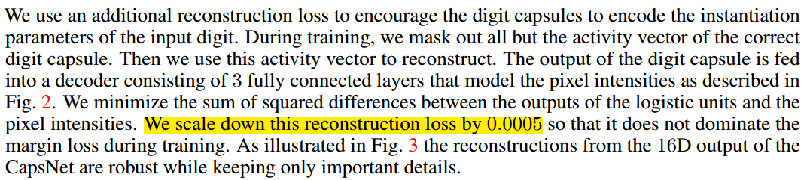

      Fig. 3:

       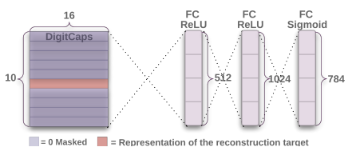

3. Experiment Result

   1. error rate on MNIST

   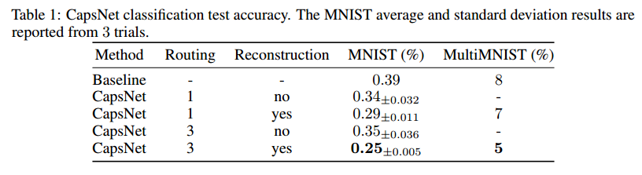

   2. What the individual dimensions of a capsule represent.

      > Since we are passing the encoding of only one digit and zeroing out other digits, the dimensions of a digit capsule should learn to span the space of variations in the way digits of that class are instantiated. These variations include stroke thickness, skew and width. They also include digit-specific variations such as the length of the tail of a 2. We can see what the individual dimensions represent by making use of the decoder network. After computing the activity vector for the correct digit capsule, we can feed a perturbed version of this activity vector to the decoder network and see how the perturbation affects the reconstruction. Examples of these perturbations are shown in Fig. 4. We found that one dimension (out of 16) of the capsule almost always represents the width of the digit. While some dimensions represent combinations of global variations, there are other dimensions that represent variation in a localized part of the digit. For example, different dimensions are used for the length of the ascender of a 6 and the size of the loop 

      Fig 4:

      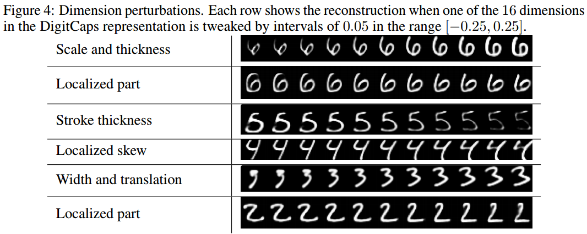

   3. Robustness to Affine Transformations 

      > To test the robustness of CapsNet to affine transformations we trained a CapsNet and a traditional convolutional network (with MaxPooling and DropOut) on a padded and translated MNIST training set, in which each example is an MNIST digit placed randomly on a black background of 40 × 40 pixels. We then tested this network on the affNIST4 data set, in which each example is an MNIST digit with a random small affine transformation.

      | Net\Accuracy | Expanded MNIST Test Set | Affined Test Set |
      | :----------: | :---------------------: | :--------------: |
      |   CapsNet    |         99.23%          |        79        |
      |     CNN      |          99.22          |        66        |

   4. Segmenting highly overlapping digits

      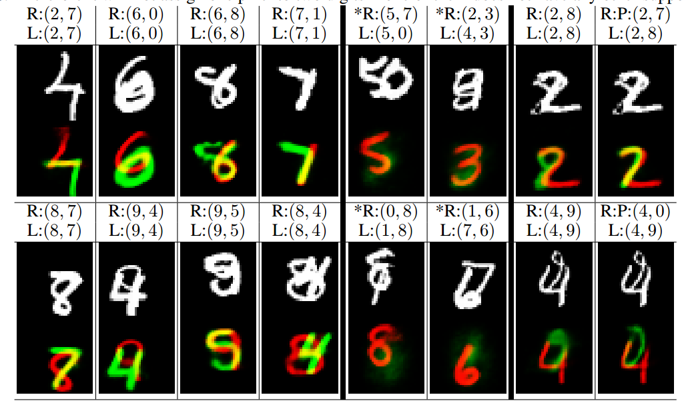

      > Figure 5: Sample reconstructions of a CapsNet with 3 routing iterations on MultiMNIST test dataset. **The two reconstructed digits are overlayed in green and red as the lower image**. The upper image shows the input image. L:(l1; l2) represents the label for the two digits in the image and R:(r1; r2) represents the two digits used for reconstruction. The two right most columns show two examples with wrong classification reconstructed from the label and from the prediction (P). In (2; 8) example the model confuses 8 with a 7 and in (4; 9) it confuses 9 with 0. The other columns have correct classifications and show that model accounts for all the pixels while being able to assign one pixel to two digits in extremely difficult scenarios (column 1 - 4). Note that in dataset generation the pixel values are clipped at 1. The two columns with **the (*) mark** show reconstructions from a digit that is neither the label nor the prediction. 

### 2.3 Drawbacks

> One drawback of Capsules which it shares with generative models is that it likes to account for
> everything in the image so it does better when it can model the clutter than when it just uses an
> additional “orphan” category in the dynamic routing. In CIFAR-10, the backgrounds are much too
> varied to model in a reasonable sized net which helps to account for the poorer performance. 


## 3 Matrix capsules with EM routing  (ICLR 2018, under review)

### 3.1 Introduction

The system in previous paper has several deficiencies  as arguing in this paper:

1. It uses the length of the pose vector to represent the probability that the entity represented by
   a capsule is present. To keep the length less than 1 requires an unprincipled non-linearity
   that prevents there from being any sensible objective function that is minimized by the
   iterative routing procedure. 
2. It uses the cosine of the angle between two pose vectors to measure their agreement. Unlike
   the log variance of a Gaussian cluster, the cosine is not good at distinguishing between quite
   good agreement and very good agreement 
3. It uses a vector of length n rather than a matrix with n elements to represent a pose, so its
   transformation matrices have n2 parameters rather than just n. 

### 3.2 Model detail

1. Model Graph

   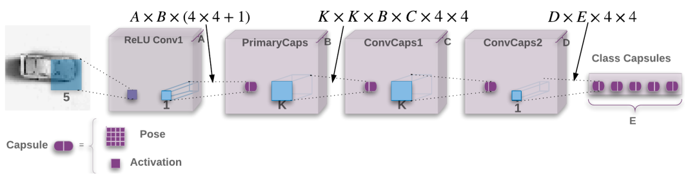

2. Gaussian mixture

   

3. EM routing

   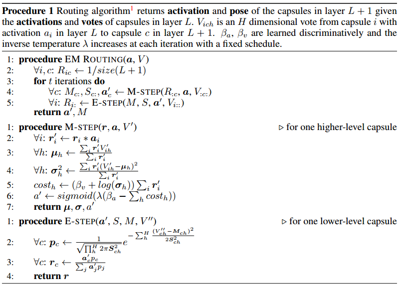

4. Experiment Result: ADVERSARIAL ROBUSTNESS 

   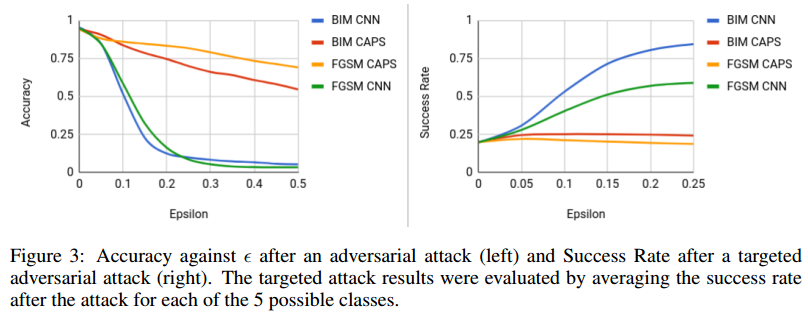

   ​

   ​

   ​

