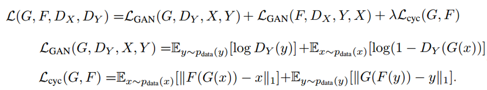

# GAN and It's Application：Cross-Domain Image Translation

## 1 GAN

### 1.1 Introduction

To learn the generator’s distribution $p_g$ over data x, we define a prior on input noise variables $p_z(z)$, then represent a mapping to data space as $G(z; θ_g)$, where $G$ is a differentiable function represented by a multilayer perceptron with parameters $θ_g$. We also define a second multilayer perceptron $D(x; θ_d)$ that outputs a single scalar. $D(x)$ represents the probability
that $x$ came from the data rather than $p_g$. We train $D$ to maximize the probability of assigning the correct label to both training examples and samples from $G$. We simultaneously train $G$ to minimize $log(1 - D(G(z)))$. In other words, $D$ and $G$ play the following two-player mini-max game with value function $V (G; D):$

$$min_G max_DV (D; G) = E_x∼p_{data(x)}[log D(x)] + E_{z∼p_z(z)}[log(1 - D(G(z)))]$$

### 1.2 Theory Result

## 2 Cycle GAN

## 2.1 Task: Cross Domain Image Translation 

Image-to-image translation is a class of vision and graphics problems where the goal is to learn the mapping between an input image and an output image.

In this paper, we present a method that can learn to do the same: capturing special characteristics of one image collection and figuring out how these characteristics could be translated into the other image collection, all in the absence of any paired training examples. 

### 2.2 Model: Cycle consistent

Loss:

### 2.3 Experiment

1. Dataset: Cityscapes dataset , map and aerial photo on data scraped from Google Maps 

2. Metrics: AMT perceptual studies, FCN score, Semantic segmentation metrics

3. Result:

   

   

   

### 2.4 Limitations

1. On translation tasks that involve color and texture changes, like many of those reported above, the method often succeeds. We have also explored tasks that require geometric changes, with little success. 
2. Some failure cases are caused by the distribution characteristics of the training datasets.
3. We also observe a lingering gap between the results achievable with paired training data and those achieved by our unpaired method.  

## 3 DIAT: Deep Identity-aware Transfer of Facial Attributes

### 3.1 Task: Identity-aware Transfer of Facial Attributes 

Our DIAT and DIAT-A models can provide a unified solution for several representative facial attribute transfer tasks such as **expression transfer**, **accessory removal**, **age progression**, and **gender** transfer 

### 3.2 Model

In this section, a two-stage scheme is developed to tackle the identity-aware attribute transfer task. 

1. Face transform network

   

   Loss: 

   

2. Face Enhancement Network

   

   Loss:

   

### 3.3 DIAT-A

In DIAT, the perceptual identity loss is defined on the pre-trained VGG-Face. Actually, it may be more effective to define this loss on some CNN trained to attribute transfer. Here we treat identity-preserving and attribute transfer as two related tasks, and define the perceptual identity loss based on the convolutional features of the discriminator. By this way, the network parameters for identity loss will be changed along with the updating of discriminator, and thus we named it as adaptive perceptual identity loss. 

### 3.4 Experiments

Dataset: a subset of the aligned CelebA dataset  

## 4 Unsupervised Cross-Domain Image Generation 

## 4.1 Task

Recent achievements replicate some of these capabilities to some degree: Generative Adversarial Networks (GANs) are able to convincingly generate novel samples that match that of a given training set; style transfer methods are able to alter the visual style of images; domain adaptation methods are able to generalize learned functions to new domains even without labeled samples in the target domain and transfer learning is now commonly used to import existing knowledge and to make learning much more efficient.

These capabilities, however, do not address the general analogy synthesis problem that we tackle in this work. Namely, **given separated but otherwise unlabeled samples from domains $S$ and $T$ and a perceptual function $f$, learn a mapping $G : S \to T$ such that $f(x) ∼ f(G(x)$ **

As a main application challenge, we tackle the problem of **emoji generation for a given facial image**. Despite a growing interest in emoji and the hurdle of creating such personal emoji manually, no system has been proposed, to our knowledge, that can solve this problem. Our method is able to produce face emoji that are visually appealing and capture much more of the facial characteristics than the emoji created by well-trained human annotators who use the conventional tools.

### 4.2 Model

## 5 StarGAN: Multi-Domain Image-to-Image Translation  

